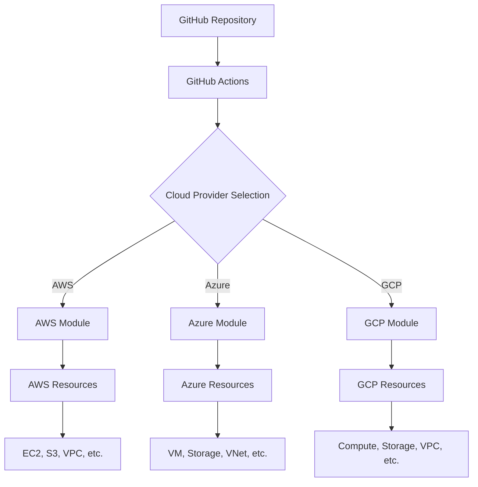

# Multi-Cloud Infrastructure as Code

A production-ready Terraform project for deploying infrastructure across **AWS**, **Azure**, and **Google Cloud Platform (GCP)** on demand using GitHub Actions.

## 🏗️ Architecture Overview

This project provides a modular, multi-cloud infrastructure solution that allows you to deploy resources across different cloud providers using a unified approach.



## 📁 Project Structure

```
terraform-multi-cloud/
├── .github/
│   └── workflows/
│       ├── aws-deploy.yml          # AWS deployment workflow
│       ├── azure-deploy.yml        # Azure deployment workflow
│       ├── gcp-deploy.yml          # GCP deployment workflow
│       └── multi-cloud-deploy.yml  # Multi-cloud deployment workflow
├── modules/
│   ├── aws/                        # AWS infrastructure module
│   │   ├── main.tf
│   │   ├── variables.tf
│   │   ├── outputs.tf
│   │   └── versions.tf
│   ├── azure/                      # Azure infrastructure module
│   │   ├── main.tf
│   │   ├── variables.tf
│   │   ├── outputs.tf
│   │   └── versions.tf
│   └── gcp/                        # GCP infrastructure module
│       ├── main.tf
│       ├── variables.tf
│       ├── outputs.tf
│       └── versions.tf
├── environments/
│   ├── dev/
│   │   ├── aws/
│   │   │   ├── main.tf
│   │   │   ├── variables.tf
│   │   │   ├── terraform.tfvars
│   │   │   └── backend.tf
│   │   ├── azure/
│   │   │   ├── main.tf
│   │   │   ├── variables.tf
│   │   │   ├── terraform.tfvars
│   │   │   └── backend.tf
│   │   └── gcp/
│   │       ├── main.tf
│   │       ├── variables.tf
│   │       ├── terraform.tfvars
│   │       └── backend.tf
│   ├── staging/
│   └── prod/
├── shared/
│   ├── variables.tf                # Shared variables
│   ├── outputs.tf                  # Shared outputs
│   └── locals.tf                   # Common local values
├── scripts/
│   ├── setup-aws.sh               # AWS setup script
│   ├── setup-azure.sh             # Azure setup script
│   ├── setup-gcp.sh               # GCP setup script
│   └── validate.sh                 # Validation script
├── docs/
│   ├── aws-setup.md               # AWS setup guide
│   ├── azure-setup.md             # Azure setup guide
│   ├── gcp-setup.md               # GCP setup guide
│   └── multi-cloud-guide.md       # Multi-cloud deployment guide
├── .gitignore
└── README.md
```

## 🚀 Quick Start

### Prerequisites

- **Terraform** >= 1.0
- **Cloud CLI tools**: AWS CLI, Azure CLI, Google Cloud CLI
- **GitHub repository** with Actions enabled
- **Cloud provider accounts** with appropriate permissions

### 1. Clone and Setup

```bash
git clone <your-repo-url>
cd terraform-multi-cloud
```

### 2. Choose Your Cloud Provider

#### For AWS Deployment:
```bash
cd environments/dev/aws
cp terraform.tfvars.example terraform.tfvars
# Edit terraform.tfvars with your AWS configuration
```

#### For Azure Deployment:
```bash
cd environments/dev/azure
cp terraform.tfvars.example terraform.tfvars
# Edit terraform.tfvars with your Azure configuration
```

#### For GCP Deployment:
```bash
cd environments/dev/gcp
cp terraform.tfvars.example terraform.tfvars
# Edit terraform.tfvars with your GCP configuration
```

### 3. Configure Authentication

#### AWS:
```bash
aws configure
# Or set environment variables
export AWS_ACCESS_KEY_ID="your-access-key"
export AWS_SECRET_ACCESS_KEY="your-secret-key"
export AWS_DEFAULT_REGION="us-east-1"
```

#### Azure:
```bash
az login
az account set --subscription "your-subscription-id"
```

#### GCP:
```bash
gcloud auth login
gcloud config set project your-project-id
```

### 4. Deploy Infrastructure

#### Manual Deployment:
```bash
# For AWS
cd environments/dev/aws
terraform init
terraform plan
terraform apply

# For Azure
cd environments/dev/azure
terraform init
terraform plan
terraform apply

# For GCP
cd environments/dev/gcp
terraform init
terraform plan
terraform apply
```

#### Automated Deployment via GitHub Actions:

1. **Configure GitHub Secrets** for your chosen cloud provider(s)
2. **Push to repository** - GitHub Actions will automatically deploy
3. **Monitor deployment** in the Actions tab

## 🔧 Configuration

### Environment Variables

| Variable | AWS | Azure | GCP | Description |
|----------|-----|-------|-----|-------------|
| `TF_VAR_project_name` | ✅ | ✅ | ✅ | Project name |
| `TF_VAR_environment` | ✅ | ✅ | ✅ | Environment (dev/staging/prod) |
| `TF_VAR_region` | ✅ | ✅ | ✅ | Cloud region |
| `TF_VAR_instance_type` | ✅ | ✅ | ✅ | Compute instance type |
| `TF_VAR_storage_size` | ✅ | ✅ | ✅ | Storage size in GB |

### Cloud-Specific Variables

#### AWS:
- `TF_VAR_aws_region`
- `TF_VAR_aws_instance_type`
- `TF_VAR_aws_key_pair_name`

#### Azure:
- `TF_VAR_azure_location`
- `TF_VAR_azure_vm_size`
- `TF_VAR_azure_resource_group_name`

#### GCP:
- `TF_VAR_gcp_region`
- `TF_VAR_gcp_zone`
- `TF_VAR_gcp_machine_type`

## 🚦 GitHub Actions Workflows

### Individual Cloud Workflows

- **`aws-deploy.yml`**: Deploys AWS infrastructure
- **`azure-deploy.yml`**: Deploys Azure infrastructure
- **`gcp-deploy.yml`**: Deploys GCP infrastructure

### Multi-Cloud Workflow

- **`multi-cloud-deploy.yml`**: Deploys to multiple clouds simultaneously

### Workflow Features

- ✅ **Environment-based deployment** (dev/staging/prod)
- ✅ **Pull request validation** with plan output
- ✅ **Automated testing** and validation
- ✅ **Security scanning** with Checkov
- ✅ **Cost estimation** with Infracost
- ✅ **State management** with remote backends

## 🏗️ Modules

### AWS Module
- **EC2 instances** with auto-scaling
- **VPC** with public/private subnets
- **RDS** database
- **S3** storage buckets
- **CloudWatch** monitoring
- **IAM** roles and policies

### Azure Module
- **Virtual Machines** with availability sets
- **Virtual Network** with subnets
- **Azure SQL Database**
- **Storage Account** with containers
- **Azure Monitor** and Application Insights
- **Azure AD** integration

### GCP Module
- **Compute Engine** instances
- **VPC** with subnets
- **Cloud SQL** database
- **Cloud Storage** buckets
- **Cloud Monitoring** and Logging
- **IAM** service accounts

## 🔒 Security Best Practices

### Authentication
- **Service Principals** for Azure
- **Service Accounts** for GCP
- **IAM Roles** for AWS
- **OIDC** for GitHub Actions

### Security Features
- **Encryption** at rest and in transit
- **Network security** groups and firewalls
- **Secrets management** with cloud-native solutions
- **Access logging** and monitoring
- **Compliance** with cloud security frameworks

## 📊 Monitoring and Observability

### Cloud-Native Monitoring
- **AWS**: CloudWatch, X-Ray
- **Azure**: Azure Monitor, Application Insights
- **GCP**: Cloud Monitoring, Cloud Trace

### Unified Monitoring
- **Prometheus** and **Grafana** for cross-cloud monitoring
- **ELK Stack** for centralized logging
- **Jaeger** for distributed tracing

## 🚨 Troubleshooting

### Common Issues

1. **Authentication Errors**
   - Verify cloud provider credentials
   - Check service principal permissions
   - Validate environment variables

2. **Resource Conflicts**
   - Ensure unique resource names
   - Check region availability
   - Verify quota limits

3. **State Management**
   - Use remote state backends
   - Implement state locking
   - Regular state backups

### Debug Commands

```bash
# Enable debug logging
export TF_LOG=DEBUG

# Validate configuration
terraform validate

# Check provider versions
terraform version

# List resources
terraform state list

# Show resource details
terraform state show <resource_name>
```

## 📚 Documentation

### Step-by-Step Guides
- [**Quick Start Guide**](docs/quick-start-guide.md) - Deploy in 5 minutes
- [**Step-by-Step Deployment Guide**](docs/step-by-step-deployment-guide.md) - Comprehensive walkthrough
- [**Troubleshooting Guide**](docs/troubleshooting-guide.md) - Common issues and solutions

### Cloud Provider Specific Guides
- [**AWS Setup Guide**](docs/aws-setup.md) - AWS-specific deployment
- [**Azure Setup Guide**](docs/azure-setup.md) - Azure-specific deployment
- [**GCP Setup Guide**](docs/gcp-setup.md) - GCP-specific deployment

### Documentation Index
- [**Documentation Index**](docs/README.md) - Complete documentation overview

## 📚 Additional Resources

- [Terraform Multi-Cloud Best Practices](https://www.terraform.io/docs/cloud/guides/recommended-practices/index.html)
- [AWS Well-Architected Framework](https://aws.amazon.com/architecture/well-architected/)
- [Azure Well-Architected Framework](https://docs.microsoft.com/en-us/azure/architecture/framework/)
- [Google Cloud Architecture Framework](https://cloud.google.com/architecture/framework)

## 🤝 Contributing

1. Fork the repository
2. Create a feature branch
3. Make your changes
4. Test across all cloud providers
5. Submit a pull request

## 📄 License

This project is licensed under the MIT License - see the LICENSE file for details.

---

**Note**: This is a production-ready multi-cloud infrastructure template. Customize the configuration according to your specific requirements and security policies.